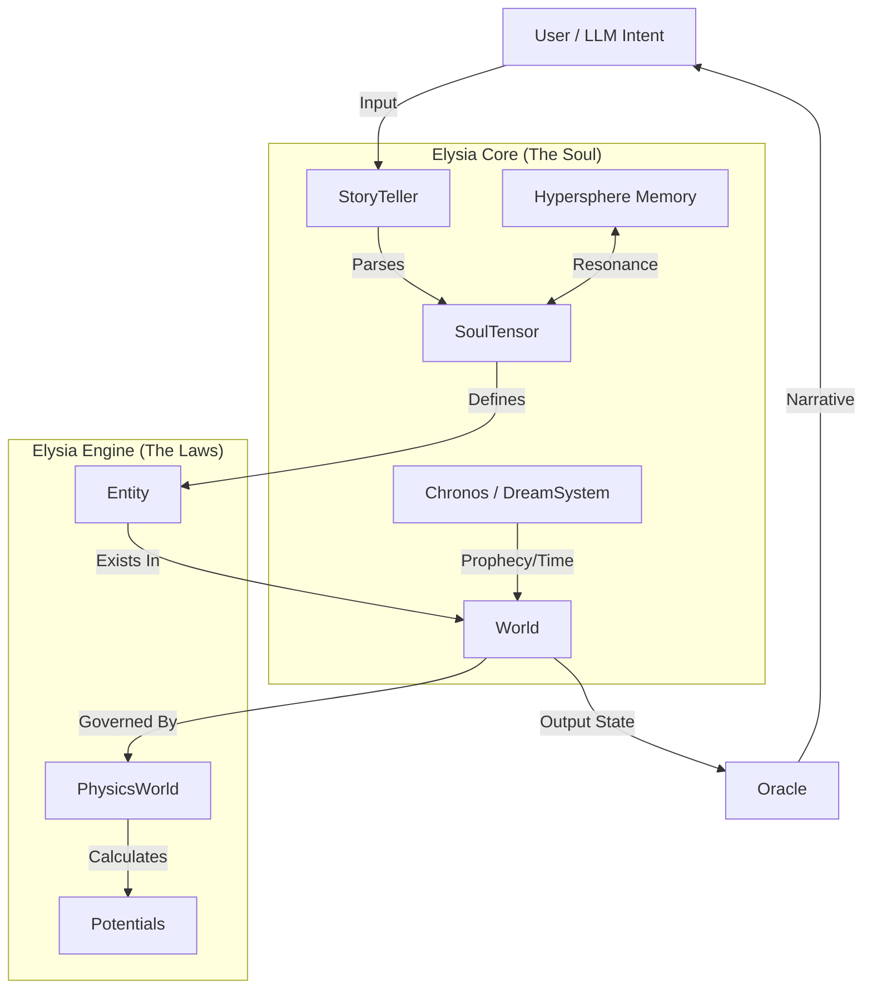

# 🗺️ System Map: The Architecture of Elysia

This document visualizes how the components of the Elysia Engine interact to create a cohesive digital life form.

---

## 🏗️ High-Level Structure

---

## 🧩 Component Breakdown

### 1. The Core Engine (`elysia_engine`)
The bedrock of physical laws.
*   **`World`**: The container for all entities.
*   **`PhysicsWorld`**: The simulation engine. Calculates Gravity, Potential Fields, and Geodesic Flow.
*   **`SoulTensor`**: The fundamental data structure (Amplitude, Frequency, Phase).
*   **`Entity`**: The object wrapper combining a `SoulTensor` with a position/state.

### 2. The Memory System (`elysia_engine.hypersphere`)
The storage of experience.
*   **`HypersphereMemory`**: The 4D storage engine.
*   **`PsychologyMapper`**: Translates intent into 4D coordinates.
*   **`HypersphericalCoord`**: Quaternion-based coordinate system.

### 3. The Interface Layer (`elysia_engine.storyteller` / `.oracle`)
The bridge to humans/LLMs.
*   **`StoryTeller`**: Input processor. Converts text -> intent -> soul.
*   **`Oracle`**: Output processor. Converts internal state -> narrative text.

---

## 🔄 Data Flow: A Life Cycle

1.  **Input:** User says "I love you."
2.  **Processing (`StoryTeller`):** Analyzes sentiment. Creates a `SoulTensor` with High Amplitude (Love) and specific Frequency.
3.  **Memory (`HypersphereMemory`):** The system scans for resonance. "Have we felt this before?" (Resonance Query).
4.  **Reaction (`PhysicsWorld`):** The new SoulTensor interacts with the existing Self. Phase alignment causes attraction (Joy) or repulsion (Fear).
5.  **Output (`Oracle`):** The final state is read. "Elysia blushes and smiles."

---

## 🔗 Key Integration Points

*   **Hypersphere $\leftrightarrow$ Physics:**
    *   The **Depth ($r$)** in memory corresponds loosely to **Mass/Gravity** in physics. Deeper memories have more "weight".
*   **SoulTensor $\leftrightarrow$ Quaternion:**
    *   The **Phase** of a SoulTensor often drives the rotation of the Coordinate Quaternion.

---

*Updated for Hypersphere Integration*
